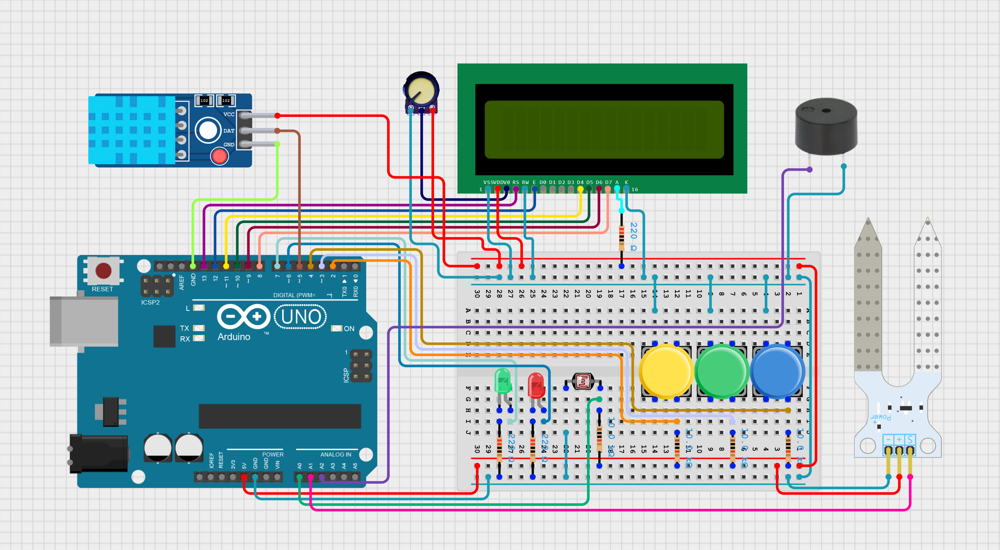

# 🌿 Plant Monitor System

A microcontroller-based monitoring system that measures ambient light, soil humidity, and environmental temperature/humidity using a DHT11 sensor. The system features automatic sensor cycling, real-time LCD display updates, error detection, UART serial reporting, and visual/auditory alerts via LEDs and a buzzer.

---

## 🔧 Features

- Monitors **3 key environmental parameters**:
  - Soil moisture (via ADC)
  - Ambient light (via ADC)
  - Temperature & humidity (via DHT11)
- **Automatic cycling** between sensors every 4 seconds
- **Error detection system** with codes for:
  - Too dry / too wet soil
  - Excessive brightness
  - Overheating
  - DHT11 sensor failure
- **LCD display** with real-time data and error messages
- **LED status indicators** and **buzzer alerts**
- **UART output** for serial monitoring of all sensor data
- **Interrupt-driven timers** for efficient, non-blocking operation

---

## 📦 Hardware Requirements

- ATmega328P (Arduino Uno)
- LCD display (16x2)
- DHT11 temperature/humidity sensor
- Photoresistor for light sensing
- Soil moisture sensor
- Buzzer
- LEDs (Red and Green)
- Potenciometer
- Push buttons for sensor selection (optional)
- Resistors and wiring for connections

---

## ⚙️ System Architecture

- **Timer1** triggers every 500ms and coordinates:
  - LCD refresh (every 500ms)
  - Sensor switching (every 4s)
  - DHT11 reads (every 4s)
  - Error checks (every 2s)
- **ADC channels** read light and soil sensors
- **UART** logs formatted sensor data and errors
- **Flags and global state** manage display refresh and cycling

---

## 📈 Sensor Thresholds

| Parameter       | Threshold         |
|----------------|-------------------|
| Soil Min       | 50 (ADC units)    |
| Soil Max       | 700 (ADC units)   |
| Light Min      | 200               |
| Light Max      | 1000              |
| Temp Max       | 30°C              |

---

## 🚨 Error Codes

| Code             | Meaning        |
|------------------|----------------|
| 0 (OK)           | No error       |
| 1                | Too bright     |
| 2                | Too hot        |
| 3                | Soil too wet   |
| 4                | Soil too dry   |
| 5                | DHT11 failure  |

Errors are shown on the LCD and indicated with a red LED + buzzer beep.

---

## 🔌 Pin Mapping

| Function         | Pin             |
|------------------|-----------------|
| Light Button     | PD2             |
| DHT11 Button     | PD3             |
| Soil Button      | PD4             |
| Red LED          | PD6             |
| Green LED        | PD7             |
| Buzzer           | PC2             |
| Light Sensor     | ADC0 (PC0)      |
| Soil Sensor      | ADC1 (PC1)      |
| UART TX          | PD1             |

---

## 🖼️ Circuit Diagram

Below is the schematic for wiring all components to the ATmega328P:

---

## 🖥️ UART Output Format

Example:
`Light: 85%, Soil: 42%, Temp: 24 deg C, Hum: 55% | Error: 0`

Use a serial monitor (e.g., Arduino Serial Monitor) at **9600 baud** to read live data.

---

## 📁 File Structure

- `main.c` - Core logic and state management
- `lcd.h` / `lcd.c` - LCD control routines
- `adc.h` / `adc.c` - ADC initialization and reads
- `dht11.h` / `dht11.c` - DHT11 communication

---

## 🧪 Setup & Usage

1. Connect sensors and components as described in the **Pin Mapping** or as shown in the **Circuit Diagram**.
2. Flash the code to your ATmega328P microcontroller.
3. Open your serial monitor at 9600 baud.
4. View sensor values on the LCD and via UART.
5. Use buttons to switch between sensors (optional) or let the system cycle automatically.

---

## 🧠 Author

**Elina Rosato**  
Email: [rosatoelina@gmail.com](mailto:rosatoelina@gmail.com)  
Website: [elinarosato.com](https://elinarosato.com)

---

## 📅 Last Updated

**29 May 2025**

---

## 📝 License

This project is licensed for academic and non-commercial use.
